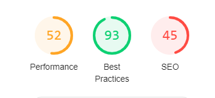
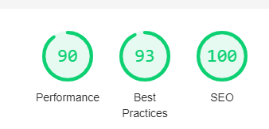

# Comments by Christian

Just run

`npm install`
`npm run start`
And visit `localhost:8080`

Overall, I think I achieved most of the results you were looking for. However, there are a few things I know I should have accomplished (and tried!) but failed due to various reasons (mostly Webpack not wanting to work with me =(). In the end, after about 4-5 hours of work time, I decided to submit the current solution.

## Cloned repo audit results

## After task completion audit results

## Vital things I think I missed
Dev and prod webpack settings + webpack-dev-server. I had created a common webpack config, and merged this with a dev and a prod config respectively, with prod adding css minification, source mapping and a more aggressive JS uglifier. However, the builds started to fail for some reason and webpack-dev-server made my life miserable, as the index file suddenly couldn't find the `bundle.js` file, or then it couldn't find the `index.html` file, or the images were not found with the source-mapping, etc. This was very frustrating and I tried, but in the end I decided to at least make it work somehow.

## Things I could have improved
- Using babel loader to use ES6
- Using React to make the process more streamlined?
- Somehow use the image imported names dynamically to add `src` to images (see commented code in `index.js`)
- Bonus task: I thought about using `will-transform` in css, `lazy-loading` and playing with `requestAnimationFrame()` with vanilla JS, but that would have cost much time
- Also make the Google Font part of the `dist`

I hope you will find the work acceptable, despite the shortcomings. I must admit tinkering with Webpack is not my specialty, but rather "real" coding of sites, javascript, calling APIs, etc.

Thank you for the opportunity!

# Website Performance Challenge
The purpose of this project is to evaluate your ability to optimize a simple webpage for performance.  
We recommend using Google Chrome's auditing tool ([Lighthouse](https://developers.google.com/web/tools/lighthouse)) in order to identify painpoints and track your progress.

## How to run?
1. `npm install`
2. `npm start`
3. Go to `http://localhost:8080/`

## What to look for?
The primary objective is to make the page load as quickly as possible.  
It's not necessary to get to 100% performance, but the closer the better.  
The secondary goal is to bring up other indicators (Best Practices and SEO).  
Consider both desktop and mobile devices.

Here are some important metrics to consider:
- Assets optimization:
  - JS and CSS minification.
  - Image sizes.
- Reduce the amount of requests.
- Decrease the time to the first meaningful paint.
- Deliver images responsively.

## Tooling
You're allowed to use any tooling you want.  
Ideally you'll want to create some automated worflow to decrease the amount of manual work to a minimum.  
Imagine this page is meant to be further developed after you optimize it. 
Therefore, your solution should be easily reproducible (e. g. using a script) as code continues to evolve.

## Bonus
If you want to score some extra points, have a look at the Performance tab within DevTools.  

You may notice that in your case it'll look a little different from the one above.  
Your task here is to spot any performance issues and solve them. **Hint**: Check the framerate.
