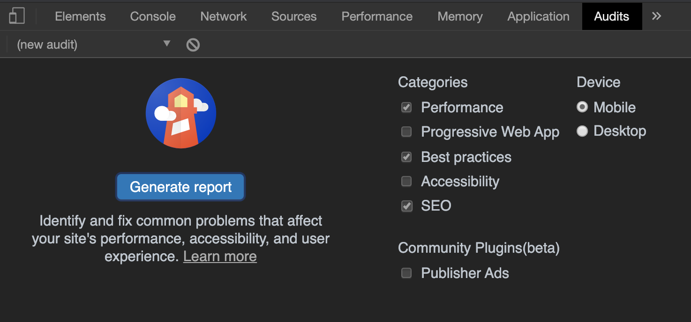
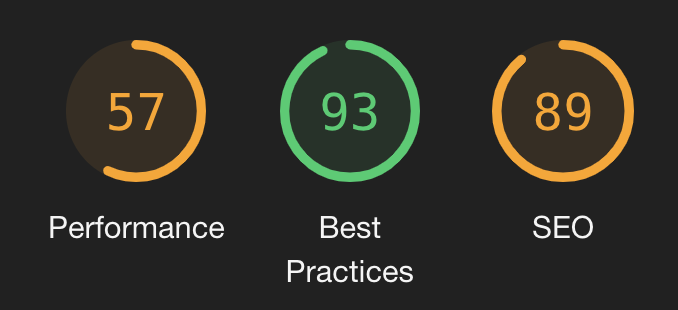
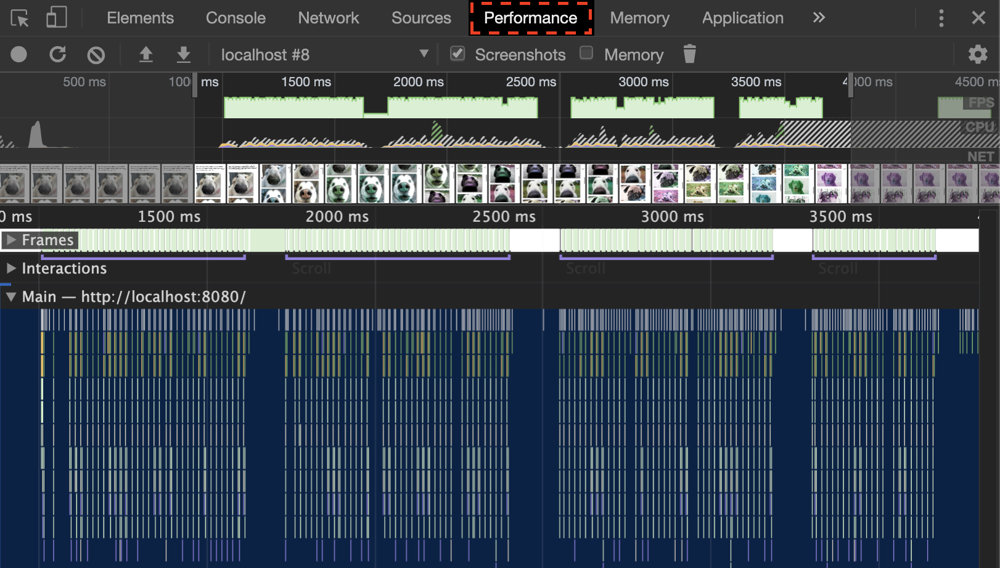

# Website Performance Challenge
The purpose of this project is to evaluate your ability to optimize a simple webpage for performance.  
We recommend using Google Chrome's auditing tool ([Lighthouse](https://developers.google.com/web/tools/lighthouse)) in order to identify painpoints and track your progress.

## How to run?
1. `npm install`
2. `npm start`
3. Go to `http://localhost:8080/`

## What to look for?
The primary objective is to make the page load as quickly as possible.  
It's not necessary to get to 100% performance, but the closer the better.  
The secondary goal is to bring up other indicators (Best Practices and SEO).  
Consider both desktop and mobile devices.

Here are some important metrics to consider:
- Assets optimization:
  - JS and CSS minification.
  - Image sizes.
- Reduce the amount of requests.
- Decrease the time to the first meaningful paint.
- Deliver images responsively.

## Tooling
You're allowed to use any tooling you want.  
Ideally you'll want to create some automated worflow to decrease the amount of manual work to a minimum.  
Imagine this page is meant to be further developed after you optimize it. 
Therefore, your solution should be easily reproducible (e. g. using a script) as code continues to evolve.

## Bonus
If you want to score some extra points, have a look at the Performance tab within DevTools.  

You may notice that in your case it'll look a little different from the one above.  
Your task here is to spot any performance issues and solve them. **Hint**: Check the framerate.
